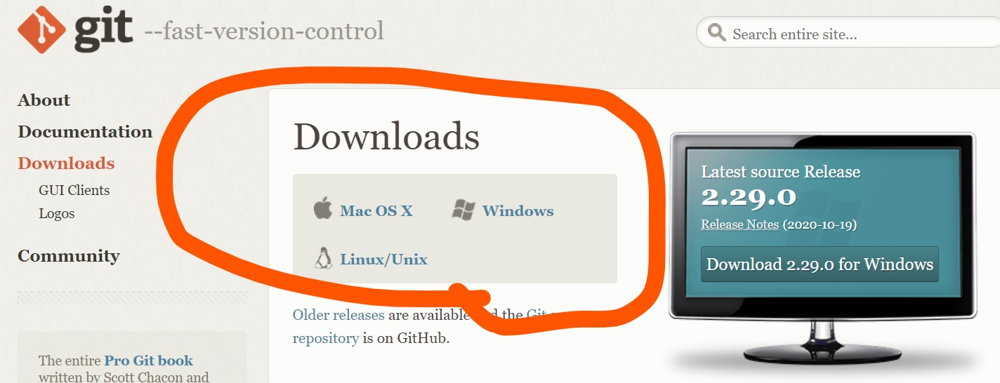
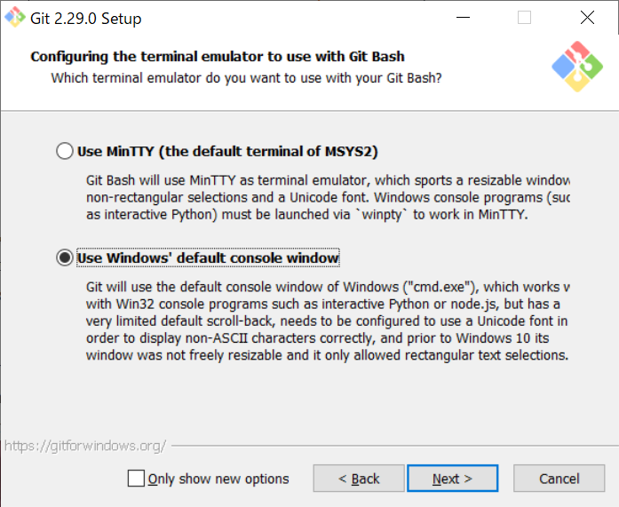
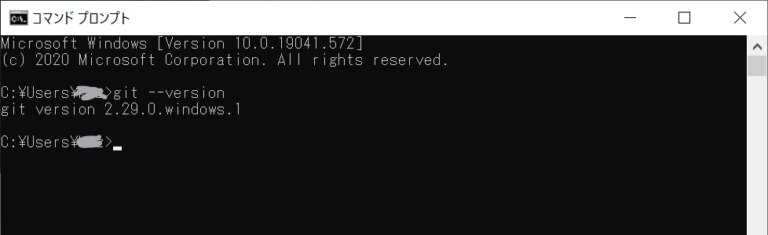

# Study Git and GitHUb.

このリポジトリーはGitとGitHubについて学べる資料を提供します。

## ゴール
- Gitとは何かがわかります
- ローカルでのGitの使い方がわかります
- Githubの基本的な使い方がわかります
- Githubの既存のリポジトリーをフォークしてPullRequestが出せます

## 最初に
困ったらなるべく使いたいサービスの **公式ドキュメント** を確認しましょう。
インターネットで検索した情報は古い場合や書いた人が間違ったことを書いている可能性があります。
公式ドキュメントが難しい場合は評判が良い初心者向けの本を購入するほうがよいです。

今回だとGitか、GitHubのDocumentをなるべく見ましょう。

- [GitHub Docs](https://docs.github.com/ja) ←こっちは日本語もある。
- [Git - Reference](https://git-scm.com/docs)

本だと [いちばんやさしいGit&GitHubの教本](https://book.impress.co.jp/books/1118101036) などがおすすめです。本はなるべく出版日が新しいものを買いましょう。

## 事前準備
ハンズオンの前までに以下をやっておいてください。
- gitのインストール
  - [Git - Downloads](https://git-scm.com/downloads) にアクセスし、自分の環境のリンクをクリックしてください。

ダウンロードしたファイルを利用して、インストールしてください。
画像部分以外の各選択肢は初期状態のままでInstallまで進んでください。

インストールが終わったら、コマンドプロンプトを立ち上げ　`git --version` と打ちます。
ダウンロードしたgitのバージョンが表示されたら成功です。

## やること
Gitってなに？かちょっと知る
- バージョン管理とは？
- バージョン管理ツールの歴史
- Githubってなに？

ローカル環境でgitコマンドを使う
- gitのインストール
- ファイルを保存しよう
- ファイルを前のバージョンに戻そう
- ブランチを使おう
- マージしよう

ローカル環境でGitHubにpushしよう
- GitHubにアカウントを作ろう
- 自分のリポジトリーにpushしよう

他の人のリポジトリーを変更する
- 他の人のリポジトリーについて
- Forkしよう
- Pull Requestしよう

レビュー
- 他の人にレビュー依頼をだそう
- レビューしよう
