# ブランチを利用しよう

## ブランチとは？
独立した更新履歴を持つ機能です。
これまではmainブランチと呼ばれるブランチに履歴を保存していました。
ブランチを作ると別の履歴を保存できるようになります。

[Git - ブランチとは](https://git-scm.com/book/ja/v2/Git-%E3%81%AE%E3%83%96%E3%83%A9%E3%83%B3%E3%83%81%E6%A9%9F%E8%83%BD-%E3%83%96%E3%83%A9%E3%83%B3%E3%83%81%E3%81%A8%E3%81%AF)

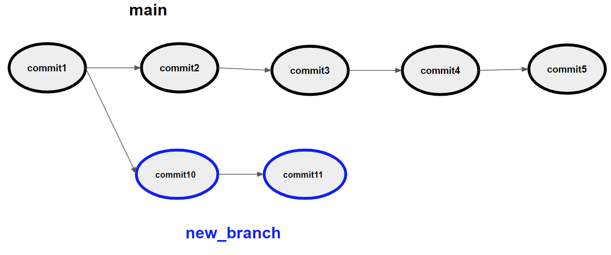


## ローカルで新しいブランチを作ろう

現状の確認（ブランチ一覧の表示）

```
git branch
```

新しいブランチを作る

```
git branch new_branch
```

ブランチで作業できるようにする。

```
git checkout new_branch
```

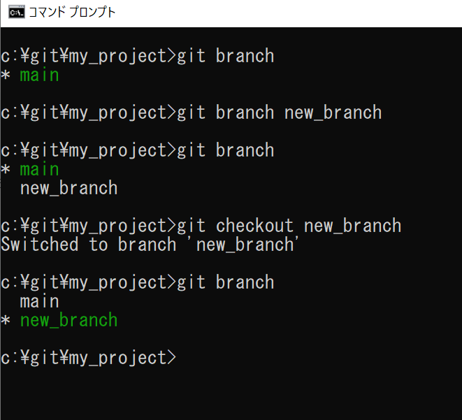

メモ: 上の2つのコマンドをcheckoutにオプション-bをつけると同時に行ったことになります。

```
git checkout -b new_branch
```

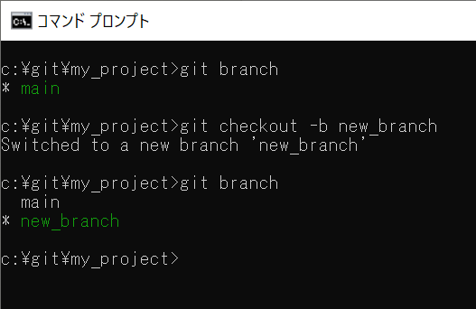

## ブランチにファイルを追加してみよう
new_branchに新しいファイルを追加します。

```
echo "Hello, Branch" > branch.txt
git add branch.txt
git commit -m "Added new file"
```

mainブランチに戻ろう

```
git checkout main
```

ファイルの一覧を見てみよう


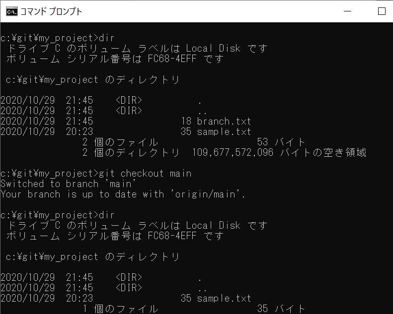

## GitHubにpushしよう

```
git checkout new_branch
git push --set-upstream origin new_branch
```

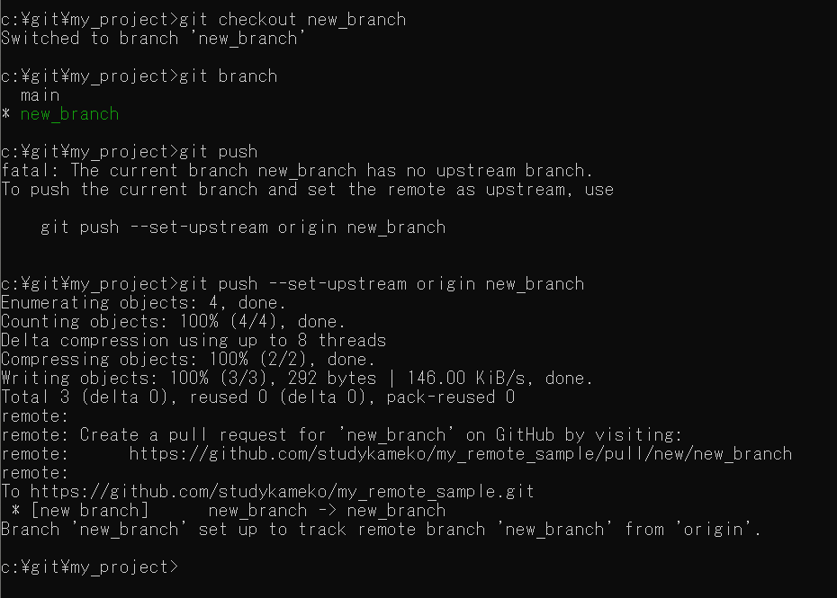

ブランチが増えていることを確認しよう

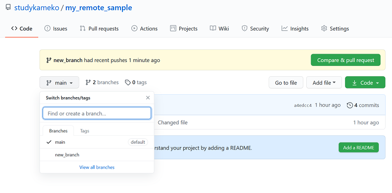

new_branchを確認しよう

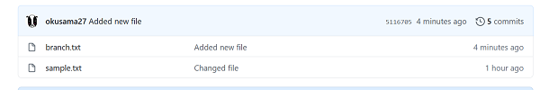

## やってみよう
- 新しいブランチを作ろう
- ローカルでファイルを追加して、新しいブランチにpushしよう

## マージする

マージとは2つのブランチを結合することです。

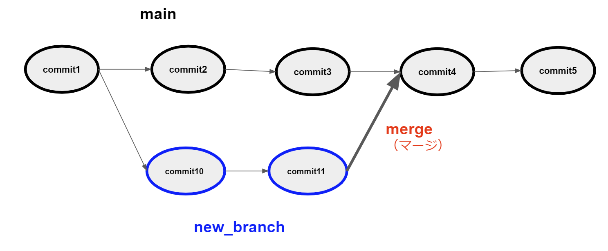

ローカルでも可能ですが、今回はGitHubの画面から行います。

PR（Pull Request）作ろう

Pull Requestとは、別のブランチに取り込んでもらうための機能です。

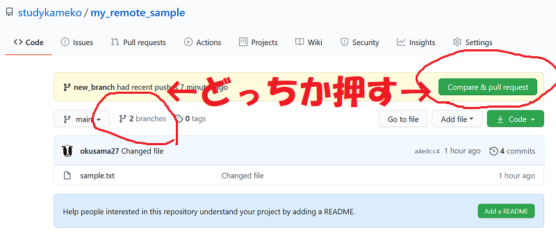

左を押した場合は、表示された画面から取り込みたいブランチを選択し、New pull request をクリックする。

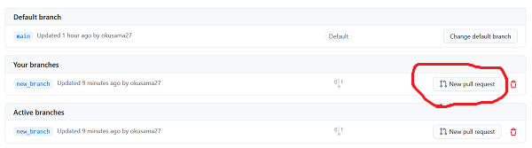

`main <- new_branch` と表示される。左側が取り込むブランチ、右側が取り込まれるブランチ。正しく選択されていない場合はこの画面で選択しまsう。


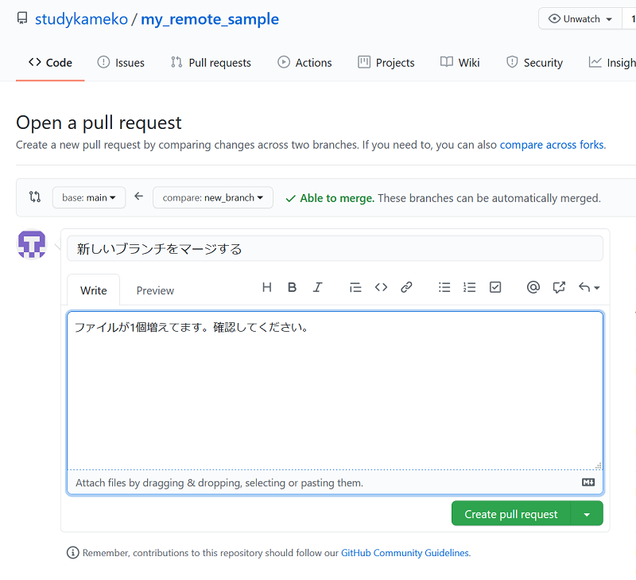

Pull Requestのタイトルと詳細を書く

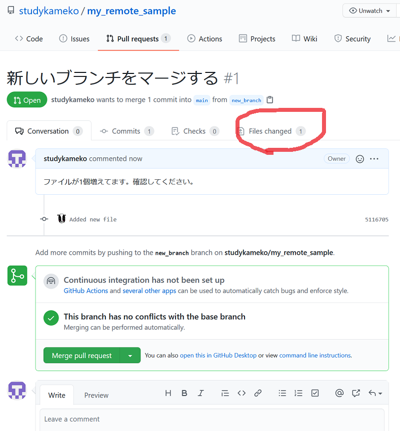

mainブランチとの違いが判る

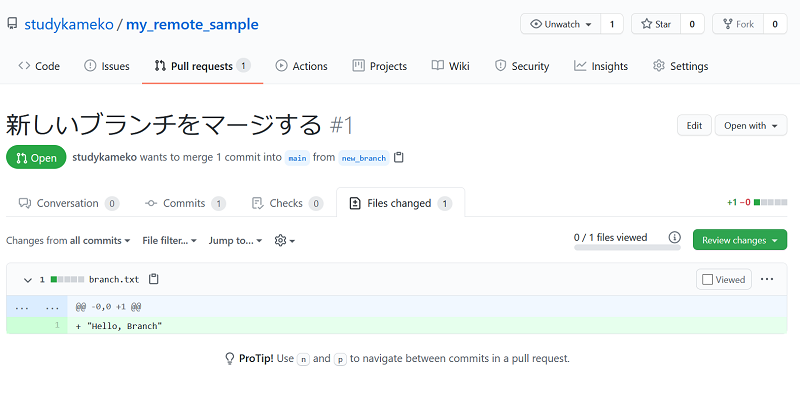

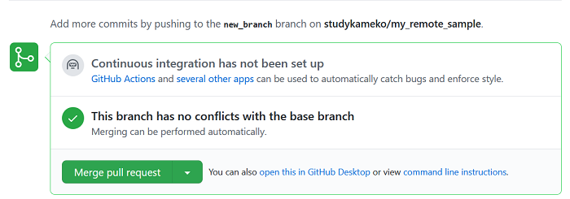

Merge pull requestボタンを押します。
マージ用のコメントを書いて、 Confirm mergeボタンを押します。
これでマージ完了です。

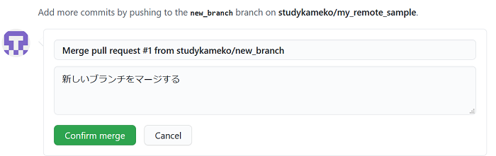

マージしたブランチはDelete branchボタンを押して消しましょう。（復活させることもできます）

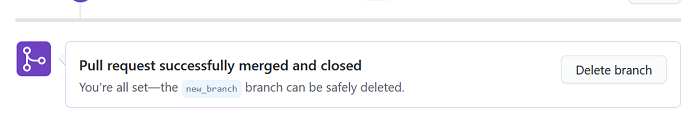

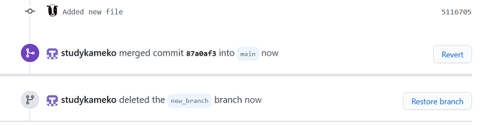

リモートでDelete branchしてもローカルのブランチは消えないので、ローカルではコマンドを利用で消しましょう
邪魔じゃないなら別に消さなくてもいいです

```
git branch -d new_branch
```

取り込まれていない作業中のブランチを消したくなった場合は `-d` の代わりに `-D` を指定します。

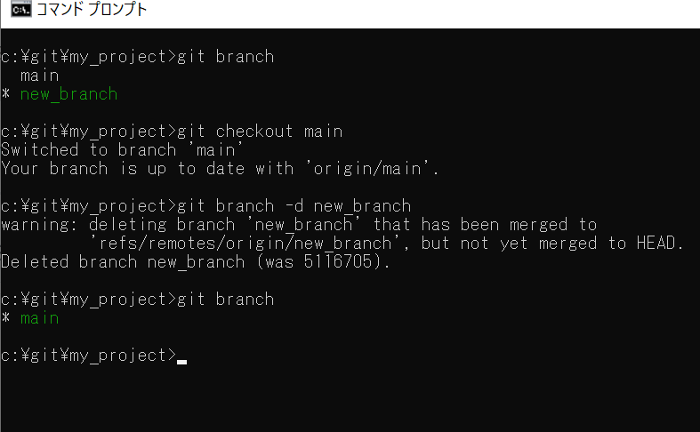

mainブランチのみになったのが確認できます。

## ローカルでマージしよう

ローカルでnew_branchブランチでの変更をmainブランチにマージします

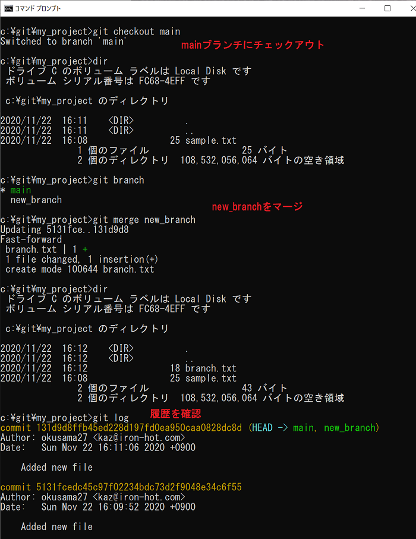

取り込みたいほうのブランチにチェックアウトして行います。
