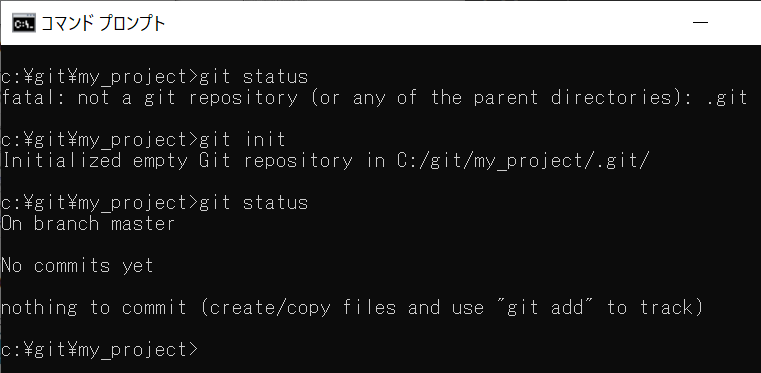
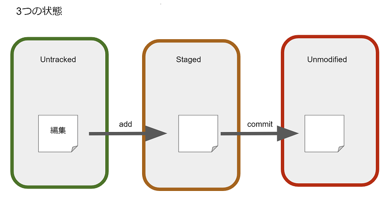
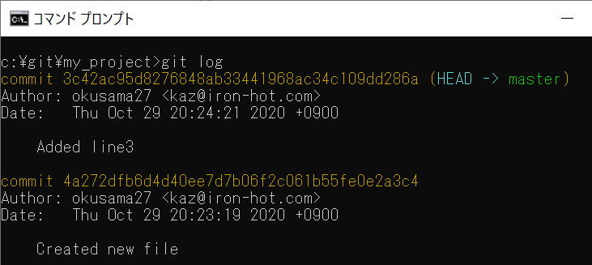

# ローカルでGitを使おう

## 目次
- [目的](目的)
- [準備](準備)
- [ファイルを管理する](ファイルを管理する)
- [履歴を見よう](履歴を見よう)
- [Gitで管理しないファイルの設定](Gitで管理しないファイルの設定)


## 目的
Gitでローカルのファイルのバージョンを管理する方法を知る

## 準備
### ローカルリポジトリを作成

詳細は以下を読もう

[Git - Git リポジトリの取得](https://git-scm.com/book/ja/v2/Git-%E3%81%AE%E5%9F%BA%E6%9C%AC-Git-%E3%83%AA%E3%83%9D%E3%82%B8%E3%83%88%E3%83%AA%E3%81%AE%E5%8F%96%E5%BE%97)

gitが使えるか確認しよう

```
git --version  # git使えるか確認
```

練習するディレクトリーを作ろう（ディレクトリー名はなんでもいいです。）
*gitから始まっているコマンドだけがgitのコマンドです。* 他のはwindowsとか、linuxとかのコマンドです。

```
mkdir my_project  # リポジトリ用のディレクトリーを作る
cd my_project  # 作ったディレクトリーに移動
```

リポジトリの初期化

```
git status  # 現在の状況を確認
git init  # リポジトリを作る
git status  # 現在の状況を確認
```

どうなっているか確認
（以下でディレクトリー内のファイルの一覧が見えるので気になった時に使ってください）

```
(win) dir /a
(mac) ls -la
```




## ファイルを管理する

詳しくは、以下を読もう

[Git - 変更内容のリポジトリへの記録](https://git-scm.com/book/ja/v2/Git-%E3%81%AE%E5%9F%BA%E6%9C%AC-%E5%A4%89%E6%9B%B4%E5%86%85%E5%AE%B9%E3%81%AE%E3%83%AA%E3%83%9D%E3%82%B8%E3%83%88%E3%83%AA%E3%81%B8%E3%81%AE%E8%A8%98%E9%8C%B2)

### 3つの状態
Gitは以下の3つの状態でファイルを管理します。

- Untracked: Gitの管理下にない状態
- Staged: ファイルをGitの管理下で編集中の状態
- Unmodified: 編集が終了して履歴に登録された状態



練習用にファイルを作ります。

```
echo "Hello, Git" > sample.txt
```

リポジトリの状況を確認（今後、コマンドを打つごとに状況を確認しましょう）

```
git status
```

作ったファイルはGitの管理下にないので、 Untracked files: の下に表示されています。


### Stagedに登録
`git add` コマンドでGitで編集を管理するStagedにファイルを登録します。

```
git add sample.txt
```

ファイルの修正

```
echo "Line2" >> sample.txt
```

変種したファイルとStagedのファイルとの比較

```
git diff sample.txt
```

変更した内容をStagedに登録

```
git add sample.txt
```

### 編集終了
`git commit` コマンドでUnmodifiedの状態にします。

```
git commit sample.txt -m "Created new file"
```

### やってみよう
- `git status` コマンドを利用して、現在のリポジトリの状態を確認しましょう
- ファイルsample.txtに3行目「Line3」を追加し、コミットしましょう

## 履歴を見よう
`git commit` の履歴を確認できます。

[Git - コミット履歴の閲覧](https://git-scm.com/book/ja/v2/Git-%E3%81%AE%E5%9F%BA%E6%9C%AC-%E3%82%B3%E3%83%9F%E3%83%83%E3%83%88%E5%B1%A5%E6%AD%B4%E3%81%AE%E9%96%B2%E8%A6%A7)

### 履歴の確認

```
git log
```



### 過去に戻る

[Git - 作業のやり直し](https://git-scm.com/book/ja/v2/Git-%E3%81%AE%E5%9F%BA%E6%9C%AC-%E4%BD%9C%E6%A5%AD%E3%81%AE%E3%82%84%E3%82%8A%E7%9B%B4%E3%81%97)

commit id を指定してそれ以降のコミットをなかったことにします。

```
git reset <commit id>
```

### やってみよう
- 新しいファイルを追加して、commit しましょう。（ファイルの追加はエクスプローラーから行ってもかまいません）
- 新しいファイルを修正して、commit しましょう。（ファイルの修正はメモ帳で行ってもかまいません）

## Gitで管理しないファイルの設定
Git で管理する予定のないファイルもUntrackedに毎回表示されてしまいます。
仮想環境用のファイル、開発ツール固有のファイル、キャッシュファイルなどはリポジトリに追加したくないファイルが表示されないようにしましょう。

#### 個人的に追加したくない
`.git/info/exclude` に対象外にしたいファイルを書く。

以下の例だと、 `test` からはじまるファイルと `.log` で終わるファイルは無視します。
```
# git ls-files --others --exclude-from=.git/info/exclude
# Lines that start with '#' are comments.
# For a project mostly in C, the following would be a good set of
# exclude patterns (uncomment them if you want to use them):
# *.[oa]
# *~
test*
*.log
```

無視されるか確認してみましょう

```
echo "Test" > test_1031.txt
echo "LogLogLog" > sample.log
git tatus
```

#### チーム全体で無視したい
`.gitignore` ファイルをリポジトリー直下に作成する
書き方はexcludeファイルと同じ
