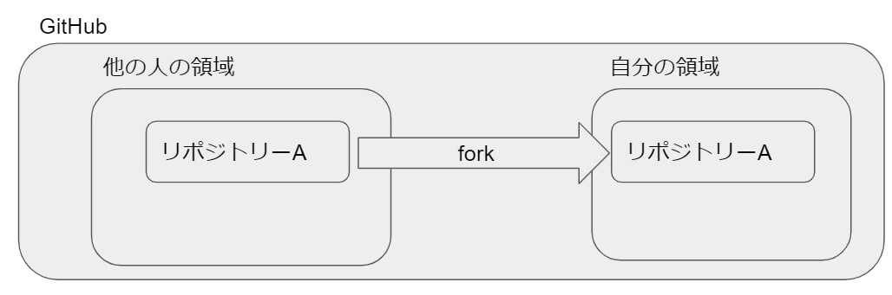
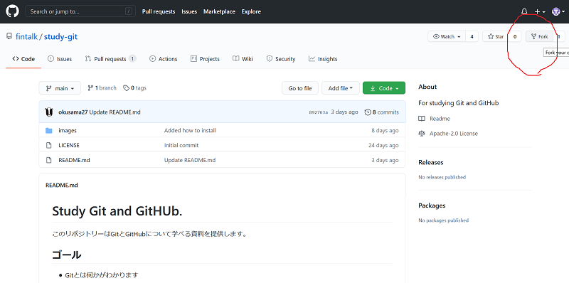
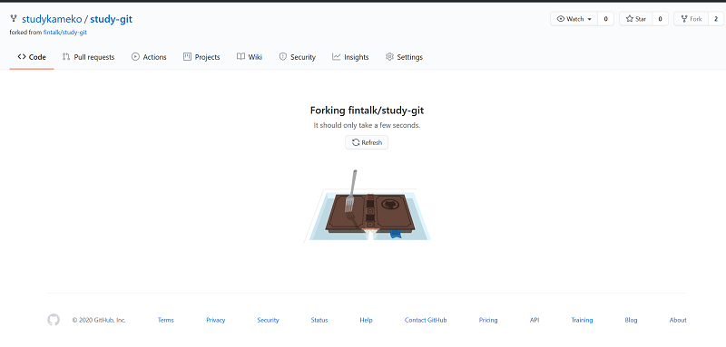
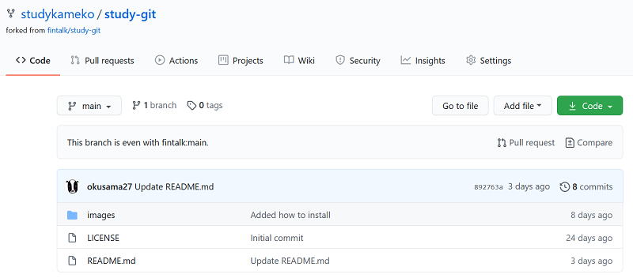
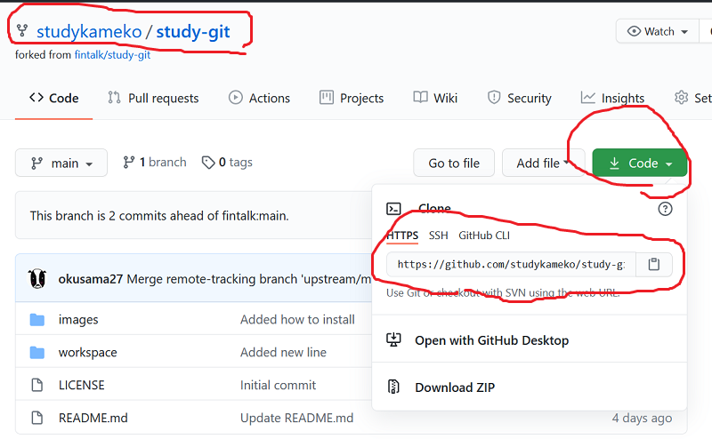
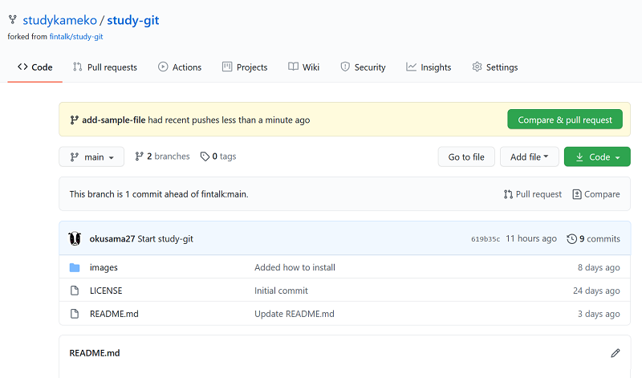
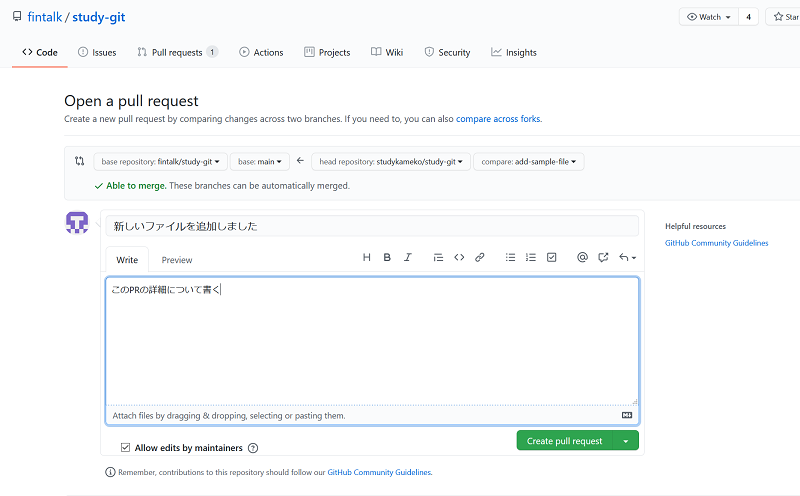
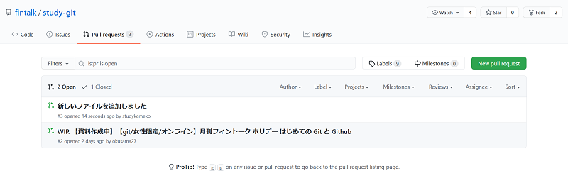
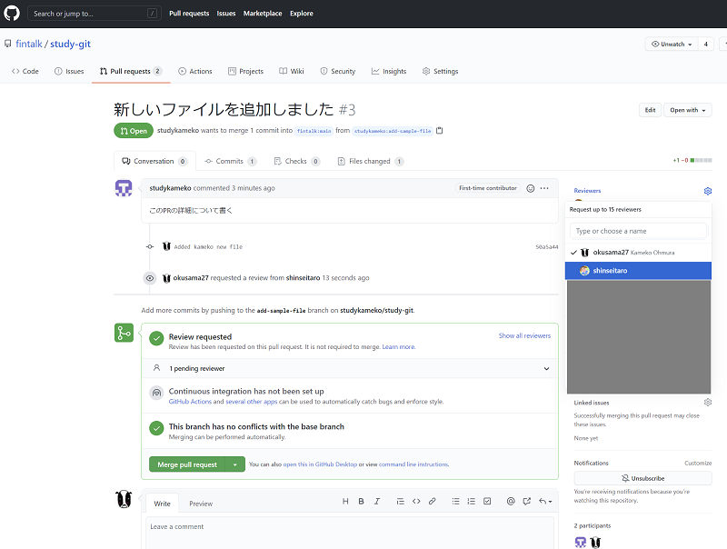
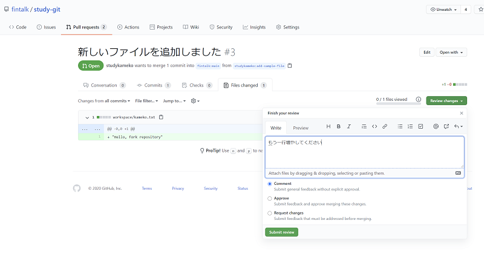

# 他の人のリポジトリーの変更依頼を出そう

ここでは他の人のリポジトリーに変更依頼を出すやり方を紹介します。

## forkしよう

forkとは他の人のリポジトリーを修正するために自分の領域にコピーすることです。



他の人のリポジトリーの内容を勝手に更新できないので、自分の領域にコピーして自分の領域にあるコピーを修正します。

以下の図（しんせいたろうさん提供）のように自分の領域のリモートリポジトリーの内容をローカルで修正します。


### やってみよう
ブラウザで https://github.com/fintalk/study-git にアクセスします



forkボタンを押すと、自分のページに study-git リポジトリーが作られます。これがfork（フォーク）です。



この自分のリモート領域にフォークしたリポジトリーをローカルで変更します。



## ローカルで編集できるようにしよう
リモートリポジトリーのコピーしてローカルリポジトリーにするには *クローン* します。
自分の環境の方のリポジトリーで行ってください。



HTTPSのテキストをコピーして、ローカルのフォルダで以下のコマンドを実行します。
新しいリポジトリーを作れるフォルダに移動してから作りましょう。

コピーした `https://` の後ろにユーザー名、パスワードをつけましょう、。

```
cd ..
git clone https://<githubのユーザー名>:<githubのパスワード>@github.com/<user名>/study-git.git
cd study-git
```

これで、study-gitにファイルを追加できる

### やってみよう
workspaceフォルダーの下に新しいファイルを作って自分のリモートリポジトリーにpushしよう

## PR作ってみよう

自分のリモートリポジトリの内容をfork元のリポジトリーに取り込んでもらうための依頼を作成します。
Pull Request を作ります。（Pull Request を略してPRと呼んだりします。プルリクと呼んだりもします。）








## 自分のリポジトリーに Pull Request がきたらレビューしよう

*以下の作業はfintalkのstudy-gitリポジトリーで行っていますが、同じ操作はfintalk領域の管理権限がないと行えないです。*
同じ作業を行うには自分の領域に他の人にPRを出してもらいましょう。

自分のリポジトリーにPull Requestが来たらレビューして取り込みましょう。





PR内容が良ければ Approve を選択します。
その後、mergeします。

## 自分の領域、ローカルをfork元の領域とそろえよう

fork元のリポジトリーの状態にしたい場合は以下のコマンドをローカルで実行します。

fork元のリポジトリーをローカルで扱えるように登録します。

```
git remote add upstream git://github.com/<fork元の領域>/study-git.git
git fetch upstream
git merge upstream/main
```

upstreamはリモートリポジトリーの別名です。別の名前でもよいです。
ローカル領域を同期したら、自分のGitHubの領域にpushしましょう。これで3つの領域すべての内容が揃います。

```
git commit -m "Merged XXXX"
git push
```